# 아임딜러 관리자 운영 매뉴얼

> 버전: 2.0 | 최종 수정: 2026-04-21 | 대상: 어드민 운영팀

---

## 목차

1. [시스템 접속 및 로그인](#1-시스템-접속-및-로그인)
2. [전체 레이아웃 및 사이드바 구조](#2-전체-레이아웃-및-사이드바-구조)
3. [대시보드](#3-대시보드)
4. [데이터 분석](#4-데이터-분석)
5. [차량 관리](#5-차량-관리)
6. [견적 데이터](#6-견적-데이터)
7. [사용자 관리](#7-사용자-관리)
8. [재고 관리](#8-재고-관리)
9. [견적 산출 로직 관리](#9-견적-산출-로직-관리)
10. [AI 관리](#10-ai-관리)
11. [운영 메모](#11-운영-메모)
12. [설정](#12-설정)
13. [서류 확인 (Verifications)](#13-서류-확인-verifications)
14. [회수율 설정 (Recovery Rates)](#14-회수율-설정-recovery-rates)
15. [PDF 내보내기 가이드](#15-pdf-내보내기-가이드)

---

## 1. 시스템 접속 및 로그인

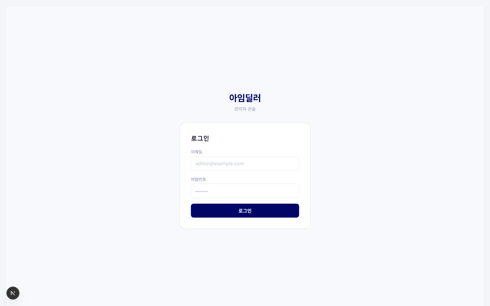

### 접속 URL

```
http(s)://[도메인]/admin/login
```

### 로그인 화면 구성

| 요소 | 설명 |
|------|------|
| 이메일 입력란 | 관리자 계정 이메일 입력 |
| 비밀번호 입력란 | 계정 비밀번호 입력 |
| 로그인 버튼 | 인증 요청 전송 (`POST /api/admin/auth/login`) |

### 로그인 처리 흐름

```
이메일 + 비밀번호 입력
→ [로그인] 클릭
→ POST /api/admin/auth/login 호출
→ 성공 시: 세션 쿠키 발급 → /admin(대시보드)으로 이동
→ 실패 시: 에러 메시지 표시 ("이메일 또는 비밀번호가 올바르지 않습니다")
```

### 권한 체계

| 역할 | 접근 가능 범위 |
|------|--------------|
| **슈퍼 관리자 (admin)** | 전체 기능 (운영 정책 관리, 관리자 권한 관리 포함) |
| **일반 관리자 (operator)** | 대시보드, 차량/견적/사용자 조회 및 편집, 개인 설정 |

> **보안 주의**: 세션 만료 후 자동으로 로그인 페이지로 리다이렉트됩니다.  
> 공용 PC 사용 시 업무 종료 후 반드시 로그아웃을 실행하세요.

---

## 2. 전체 레이아웃 및 사이드바 구조

### 화면 구성

```
┌─────────────────────────────────────────────────────┐
│  사이드바(220px)  │         메인 콘텐츠 영역           │
│                   │                                  │
│  로고             │  각 페이지의 내용이 표시됨          │
│  ─────────────    │  배경색: #F4F5F8                  │
│  내비게이션 메뉴  │                                  │
│                   │                                  │
│  ─────────────    │                                  │
│  관리자 정보      │                                  │
│  [로그아웃]       │                                  │
└─────────────────────────────────────────────────────┘
```

### 사이드바 메뉴 구조

| 섹션 | 메뉴명 | 경로 | 아이콘 |
|------|--------|------|--------|
| (상단) | 대시보드 | `/admin` | LayoutDashboard |
| (상단) | 데이터 분석 | `/admin/analytics` | BarChart3 |
| **핵심 관리** | 차량 관리 | `/admin/vehicles` | Car |
| **핵심 관리** | 견적 데이터 | `/admin/quotations` | FileText |
| **핵심 관리** | 사용자 관리 | `/admin/users` | Users |
| **핵심 관리** | 재고관리 | `/admin/inventory` | Package |
| **정책 및 AI** | 견적 산출 로직 관리 | `/admin/finance` | Calculator |
| **정책 및 AI** | AI 관리 | `/admin/ai` | Brain |
| **시스템** | 운영 메모 | `/admin/memo` | StickyNote |
| **시스템** | 설정 | `/admin/settings` | Settings |

### 사이드바 동작

- **활성 메뉴**: 짙은 파랑 배경(`#000666`) + 좌측 흰색 보더 + 아이콘 색상 변경(`#6066EE`)
- **비활성 메뉴**: 호버 시 배경색 살짝 밝아짐
- **로그아웃 버튼**: 클릭 시 `POST /api/admin/auth/logout` → 세션 삭제 → `/admin/login`으로 이동

### 사이드바 하단 사용자 정보

- 관리자 이름, 이메일 표시
- 아바타 아이콘 (이니셜)
- [로그아웃] 버튼

---

## 3. 대시보드

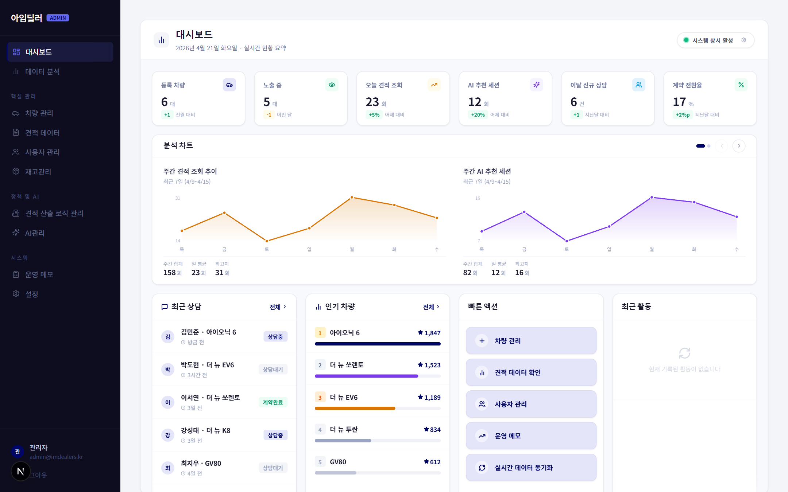

**경로**: `/admin`  
**목적**: 플랫폼 전체 현황을 한눈에 파악

### 화면 구성 개요

```
┌─────────────────────────────────────────────────────────┐
│  [●] 시스템 상태     아임딜러 대시보드            [●●●] │
├──────────┬──────────┬──────────┬──────────┬─────────────┤
│ 등록 차량 │ 노출 중  │오늘 견적 │AI 추천   │이달 신규상담│
│  카드    │  카드   │  카드   │세션 카드  │  카드       │
│         │         │         │          │             │
├─────────────────────────┬───────────────────────────────┤
│       차트 영역          │  최근 상담 / 인기 차량 /       │
│  (4가지 차트 순환)       │  빠른 액션 / 최근 활동        │
└─────────────────────────┴───────────────────────────────┘
```

### 상단 시스템 상태 표시

| 요소 | 설명 |
|------|------|
| 초록 점 (animate-ping) | 시스템 정상 동작 중 |
| 빨간 점 | 시스템 비활성 상태 |
| [상태 토글 버튼] | 클릭 시 isSystemActive 상태 전환 (데모용) |

### KPI 카드 (5개)

| 카드명 | 데이터 출처 | 표시 형식 |
|--------|------------|---------|
| 등록 차량 (Registered Vehicles) | DB 차량 총 수 | 정수 |
| 노출 중 (Visible Vehicles) | isVisible=true 차량 수 | 정수 |
| 오늘 견적 조회 (Today's Quote Views) | 당일 견적 이벤트 수 | 정수 |
| AI 추천 세션 (AI Sessions) | AI 추천 요청 세션 수 | 정수 |
| 이달 신규 상담 (Monthly Consultations) | 해당 월 견적 생성 수 | 정수 |

> **데이터 로딩**: 서버 컴포넌트(`page.tsx`)에서 SSR로 초기 데이터 fetch  
> `GET /api/admin/dashboard/stats` 호출 결과를 표시

### 차트 캐러셀 (4종 순환)

| 차트 | 종류 | 데이터 |
|------|------|--------|
| 주간 견적 트렌드 | SVG 라인 차트 | 최근 7일 일별 견적 수 |
| 주간 AI 세션 | SVG 라인 차트 | 최근 7일 AI 추천 세션 수 |
| 차량 카테고리 분포 | SVG 도넛 차트 | 카테고리별 차량 비율 |
| 월별 상담 현황 | SVG 바 차트 | 최근 월별 상담 건수 |

**차트 네비게이션 버튼**:
- `[←]` (이전 버튼): 이전 차트로 이동 (0번째에서 클릭 시 마지막 차트로 순환)
- `[→]` (다음 버튼): 다음 차트로 이동 (마지막에서 클릭 시 첫 번째로 순환)
- `[●●●●]` (인디케이터 점): 해당 인덱스 차트로 직접 이동

### 하단 4-컬럼 섹션

#### 최근 상담 (Recent Consultations)

- 최근 견적 생성 목록 표시 (스크롤 가능)
- 각 항목 클릭 시 → `/admin/quotations?id={id}` 이동
- 고객명, 차량명, 시간 표시

#### 인기 차량 (Popular Vehicles)

- 조회 수 기준 Top 5 차량 목록
- 각 차량별 조회 수 + 프로그레스 바 표시
- 클릭 시 → `/admin/vehicles/{id}` 이동

#### 빠른 액션 (Quick Actions)

| 버튼 | 이동 경로 / 동작 |
|------|----------------|
| 견적 관리 | `/admin/quotations` |
| 차량 등록 | `/admin/vehicles` |
| 사용자 조회 | `/admin/users` |
| 운영 메모 | `/admin/memo` |
| **[데이터 동기화]** | window 이벤트 `activity_updated` 발생 → 활동 피드 갱신 + 스피너 표시 (2초) |

#### 최근 활동 (Recent Activity)

- 시스템 내 최근 이벤트 피드 (관리자 액션 로그)
- 실시간 업데이트 (window 이벤트 `activity_updated` 수신 시 재렌더링)
- 각 활동에 시간, 유형, 설명 표시

---

## 4. 데이터 분석

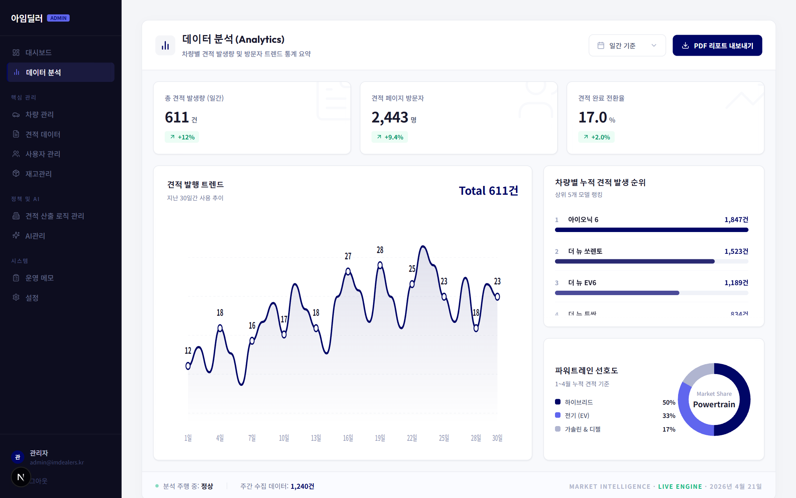

**경로**: `/admin/analytics`  
**목적**: 30일간의 플랫폼 데이터를 시각적으로 분석

### 화면 구성 개요

```
┌──────────────────────────────────────────────────────┐
│  데이터 분석    [기간 선택▼]    [PDF 내보내기]       │
├──────────┬──────────┬──────────────────────────────  │
│ 총 견적량 │ 방문자  │ 견적 전환율                    │
├──────────┴──────────┴──────────────────────────────  │
│                                      │ 차량 순위      │
│   메인 트렌드 차트 (SVG Line)         │ 리더보드       │
│                                      │                │
│                                      │ 파워트레인     │
│                                      │ 도넛 차트      │
└──────────────────────────────────────────────────────┘
│  데이터 수집 중... N건               [상태바]         │
```

### 상단 컨트롤

#### 기간 선택 드롭다운

| 옵션 | 동작 |
|------|------|
| 일간 (Daily) | RANGE_DATA를 일간 데이터로 전환 |
| 주간 (Weekly) | RANGE_DATA를 주간 집계 데이터로 전환 |
| 월간 (Monthly) | RANGE_DATA를 월간 집계 데이터로 전환 |

> 기간 변경 시 차트와 KPI 카드가 즉시 업데이트됩니다.

#### PDF 내보내기 버튼

```
[PDF 내보내기] 클릭
→ window.print() 실행
→ 브라우저 인쇄 다이얼로그 열림
→ PDF로 저장 선택 가능
```

> **팁**: 인쇄 시 배경 그래픽을 포함하여 인쇄해야 차트가 정상 출력됩니다.

### KPI 카드 (3개)

| 카드 | 설명 |
|------|------|
| 총 견적 발생량 | 선택 기간 내 견적 생성 총 건수 |
| 견적 페이지 방문자 | 선택 기간 내 차량 상세 페이지 방문자 수 |
| 견적 완료 전환율 | (견적 완료 수 / 방문자 수) × 100% |

### 메인 트렌드 차트

- SVG 라인 차트 (그라디언트 채움 포함)
- X축: 날짜/기간, Y축: 견적 건수
- 데이터 포인트 호버 시 툴팁 표시
- 선택 기간 변경 시 애니메이션으로 전환

### 차량 순위 리더보드

- Top 5 차량 목록
- 각 차량별 견적 건수 + 상대적 바 차트
- 순위 변동 화살표 (↑ 상승 / ↓ 하락 / - 유지) 표시

### 파워트레인 선호도 도넛 차트

- 연료 유형별(가솔린/디젤/하이브리드/전기) 비율
- 중앙에 총 견적 건수 표시
- 우측에 범례(Legend) 표시

### 하단 상태바

- "분석 엔진 가동 중..." 텍스트
- 실시간 데이터 수집 건수 카운터 (animate)

---

## 5. 차량 관리

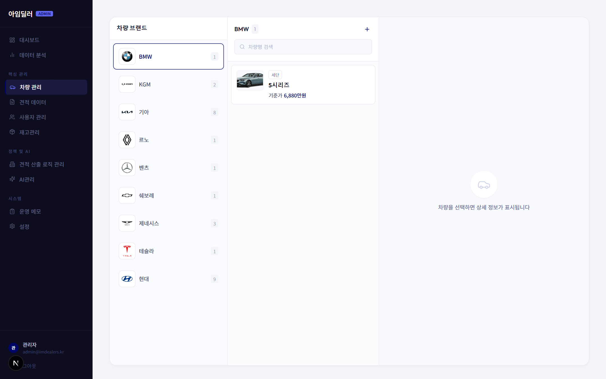

**경로**: `/admin/vehicles` 및 `/admin/vehicles/[id]`  
**목적**: 차량 등록, 수정, 삭제 및 트림/옵션/규칙/라인업 관리

### 차량 상세 패널 미리보기


### 화면 구성 — 3열 레이아웃

```
┌────────────────┬──────────────────────┬────────────────────────┐
│  브랜드 목록   │     차량 목록        │     차량 상세 정보      │
│  (BrandList)  │    (VehicleList)     │    (VehicleDetail)     │
│               │                      │                        │
│  [+ 브랜드]   │  [검색창]   [+ 차량]  │  기본정보 / 트림 / 옵션 │
│               │                      │  / 규칙 / 라인업       │
└────────────────┴──────────────────────┴────────────────────────┘
```

### 브랜드 목록 패널 (BrandList)

| 요소 | 동작 |
|------|------|
| 브랜드 버튼 (각 브랜드) | 클릭 시 해당 브랜드의 차량만 중앙 패널에 표시 |
| 각 브랜드 옆 숫자 배지 | 해당 브랜드에 속한 차량 수 |
| 선택된 브랜드 | 배경색 강조 처리 |

### 차량 목록 패널 (VehicleList)

| 요소 | 동작 |
|------|------|
| 검색창 | 입력 시 차량명으로 실시간 필터링 |
| [+ 차량 추가] 버튼 | 차량 추가 모달(`VehicleFormModal`) 열기 |
| 차량 카드 클릭 | 우측 상세 패널에 해당 차량 정보 표시 |
| 차량 카드의 [편집] 버튼 | 차량 편집 모달 열기 |
| 차량 카드의 [삭제] 버튼 | 삭제 확인 모달(`DeleteVehicleModal`) 열기 |

### 차량 추가/편집 모달 (VehicleFormModal)

입력 필드:

| 필드 | 설명 |
|------|------|
| 차량명 | 차량 모델명 (예: 쏘렌토) |
| 브랜드 | 드롭다운에서 선택 |
| 카테고리 | 국산 / 수입 선택 |
| 연료 유형 | 가솔린 / 디젤 / 하이브리드 / 전기 |
| 기본 가격 | 차량 대표 가격 (정수, 원 단위) |
| 슬러그(slug) | URL 식별자 (자동 생성 또는 직접 입력) |
| 노출 여부 | 체크박스 (isVisible) |
| 이미지 | 파일 업로드 (`POST /api/admin/upload`) |

버튼:

| 버튼 | 동작 |
|------|------|
| [저장] | 신규: `POST /api/admin/vehicles` / 수정: `PATCH /api/admin/vehicles/[id]` |
| [취소] | 모달 닫기 |

### 차량 삭제 확인 모달 (DeleteVehicleModal)

```
"[차량명]을(를) 삭제하시겠습니까?
이 작업은 되돌릴 수 없습니다."

[취소]  [삭제 확인]

→ [삭제 확인] 클릭 시: DELETE /api/admin/vehicles/[id]
→ 성공 시: 차량 목록에서 제거
```

### 차량 상세 패널 (VehicleDetail)

탭 구성:

#### 탭 1: 기본 정보

- 차량명, 브랜드, 카테고리, 가격, 연료 유형 표시
- [기본 정보 편집] 버튼 → 편집 모달 열기
- 이미지 미리보기 표시

#### 탭 2: 트림 관리 (Trims)

| 요소 | 동작 |
|------|------|
| 트림 목록 | 차량에 속한 모든 트림 표시 |
| [+ 트림 추가] | 트림 이름, 엔진 타입, 기본 플래그 입력 폼 표시 |
| 트림의 [편집] | 해당 트림 수정 (`PATCH /api/admin/vehicles/[id]/trims/[trimId]`) |
| 트림의 [삭제] | 해당 트림 삭제 (`DELETE /api/admin/vehicles/[id]/trims/[trimId]`) |

트림 필드:

| 필드 | 설명 |
|------|------|
| 트림명 | 예: 프리미엄, 시그니처 |
| 엔진 타입 | 가솔린 / 디젤 / 하이브리드 / 전기 |
| 기본 트림 여부 | 대표 트림으로 설정 여부 체크박스 |

#### 탭 3: 옵션 관리 (Options)

- 트림별로 옵션 목록 표시
- [+ 옵션 추가] → 옵션명, 가격, 의존성 규칙 입력
- 옵션 [편집] / [삭제] 버튼

옵션 필드:

| 필드 | 설명 |
|------|------|
| 옵션명 | 예: 프리미엄 사운드 패키지 |
| 추가 가격 | 옵션 선택 시 더해지는 금액 |
| 필수 여부 | 선택 필수 여부 |

#### 탭 4: 라인업 관리 (Lineups)

- 특정 트림+옵션 조합의 실제 출고 가격 정의
- [+ 라인업 추가]: `POST /api/admin/vehicles/[id]/lineups`
- 라인업별 [편집] / [삭제]

#### 탭 5: 규칙 관리 (Rules)

- 옵션 선택 제약 규칙 정의
- 예: "옵션 A와 옵션 B는 동시 선택 불가"
- [+ 규칙 추가]: `POST /api/admin/trims/[trimId]/rules`

---

## 6. 견적 데이터

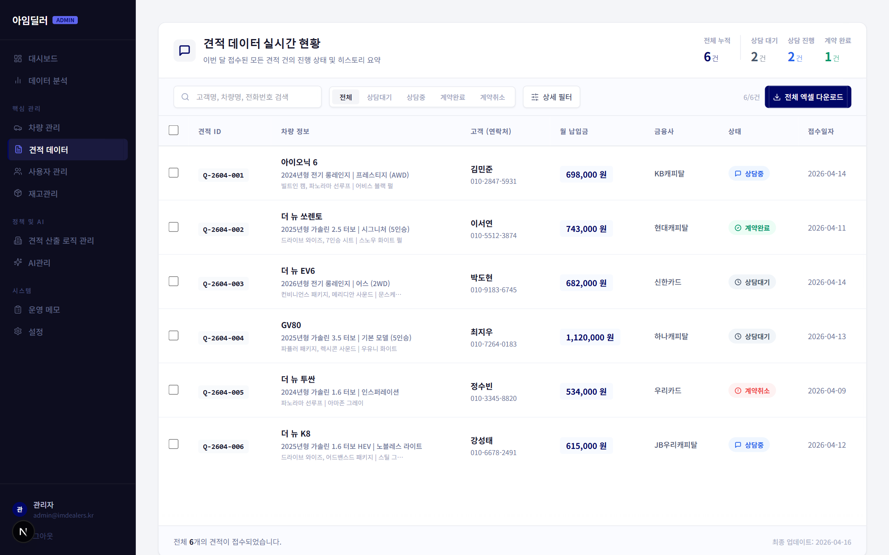

**경로**: `/admin/quotations`  
**목적**: 고객이 생성한 견적 실시간 조회, 상태 관리, 메모 작성

### 화면 구성 개요

```
┌──────────────────────────────────────────────────────────────┐
│ 견적 데이터 실시간 현황                                       │
├──────┬──────┬──────┬──────┐                                  │
│ 전체 │대기  │ 진행 │완료  │  (KPI 카드)                      │
├──────┴──────┴──────┴──────┘                                  │
│ [검색창]  [상태 필터탭]  [상세 필터 ▼]  [엑셀 내보내기]      │
│ ─── 상세 필터 패널 (토글) ─────────────────────────────────  │
├──────────────────────────────────────────────────────────────┤
│ ☐ │ ID │ 차량정보 │ 고객 │ 월납입금 │ 금융사 │ 상태 │ 접수일 │
│ ☐ │ ...│   ...   │ ... │   ...   │  ...  │ ...  │  ...  │
│                                                              │
├──────────────────────────────────────────────────────────────┤
│  [N개 선택됨]  [상태 변경 ▼]  [일괄 삭제]   ← 플로팅 액션 바 │
└──────────────────────────────────────────────────────────────┘
                                    ┌────────────────────────┐
                                    │  상세 Drawer (우측)     │
                                    │  견적 ID / 고객명       │
                                    │  상태 드롭다운          │
                                    │  차량 스펙 상세         │
                                    │  금융 요약 박스         │
                                    │  딜러 메모 텍스트에어리어│
                                    └────────────────────────┘
```

### 견적 상세 Drawer 미리보기

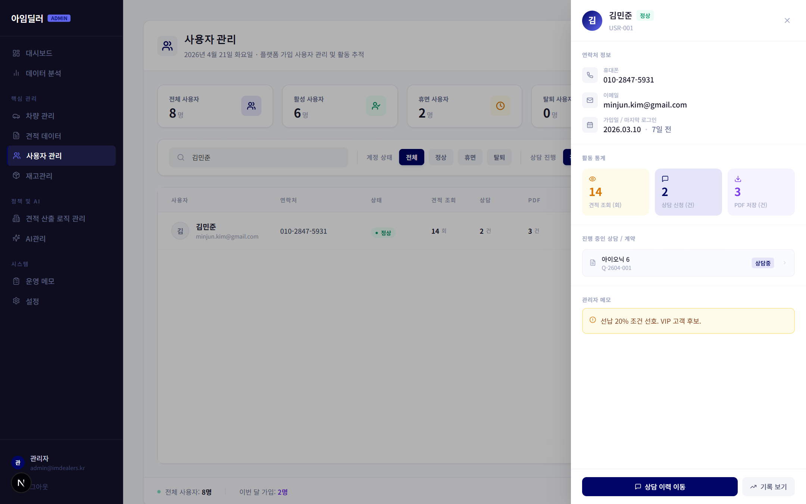

### KPI 카드 (상단)

| 카드 | 설명 |
|------|------|
| 전체 견적 | 총 견적 건수 |
| 상담 대기 | status = PENDING |
| 상담 중 | status = IN_PROGRESS |
| 계약 완료 | status = COMPLETED |

### 검색 및 필터

#### 검색창

- 고객명, 차량명, 전화번호로 검색
- 입력 시 실시간 필터링 (클라이언트 사이드)

#### 상태 필터 탭

| 탭 | 필터 조건 |
|----|---------|
| 전체 | 필터 없음 |
| 상담대기 | status = PENDING |
| 상담중 | status = IN_PROGRESS |
| 계약완료 | status = COMPLETED |
| 계약취소 | status = CANCELLED |

#### 상세 필터 패널 (토글)

[상세 필터 ▼] 버튼 클릭 시 패널 슬라이드 다운:

| 필터 | 입력 유형 |
|------|---------|
| 금융사 | 드롭다운 선택 |
| 접수일 시작 | 날짜 입력 |
| 접수일 종료 | 날짜 입력 |
| 월 납입금 최소 | 숫자 입력 (원) |
| 월 납입금 최대 | 숫자 입력 (원) |
| [필터 초기화] | 모든 상세 필터 초기화 |

#### 엑셀 내보내기 버튼

```
[엑셀 내보내기] 클릭
→ 현재 필터 조건의 견적 데이터를 CSV/Excel 파일로 생성
→ 브라우저 다운로드 다이얼로그 실행
```

### 견적 테이블

| 컬럼 | 설명 |
|------|------|
| 체크박스 | 행 선택 (일괄 작업용) |
| 견적 ID | 견적 고유 번호 |
| 차량 정보 | 차량명, 라인업, 트림, 옵션, 색상 |
| 고객 | 고객명(클릭 시 사용자 관리 페이지 이동) + 전화번호 |
| 월 납입금 | 계산된 월 납입 금액 (원) |
| 금융사 | 금융사명 |
| 상태 | 상태 뱃지 (색상 코딩) |
| 접수일 | 견적 생성 일시 |

#### 행 클릭 동작

```
테이블 행 클릭
→ 우측에 상세 Drawer 슬라이드 인 (transition 애니메이션)
→ Drawer 내 해당 견적의 상세 정보 표시
```

### 플로팅 액션 바 (다중 선택 시)

체크박스로 1개 이상 선택 시 하단에 플로팅 바 등장:

| 요소 | 동작 |
|------|------|
| "N개 선택됨" | 선택된 행 수 표시 |
| [상태 변경 ▼] | 드롭다운으로 상태 선택 → 선택된 모든 견적의 상태 일괄 변경 |
| [일괄 삭제] | 확인 다이얼로그 후 선택 견적 모두 삭제 |

### 견적 상세 Drawer (우측 패널)

| 영역 | 내용 |
|------|------|
| 헤더 | 견적 ID, 고객명 (링크: `/admin/users?search=고객명`) |
| 상태 드롭다운 | 상태 변경 → 즉시 API 호출 → 활동 로그 기록 |
| 고객 연락처 | 전화번호, 이메일 |
| 차량 스펙 | 차량명, 라인업, 트림, 선택 옵션, 색상, 약정 거리, 계약 기간 |
| 금융 요약 | 월 납입금, 계약 기간, 보증금/선납금, 금융사 |
| 딜러 메모 | 자유 입력 텍스트에어리어 (저장 버튼 없이 blur 시 자동 저장) |
| [닫기 ✕] | Drawer 닫기 |

---

## 7. 사용자 관리

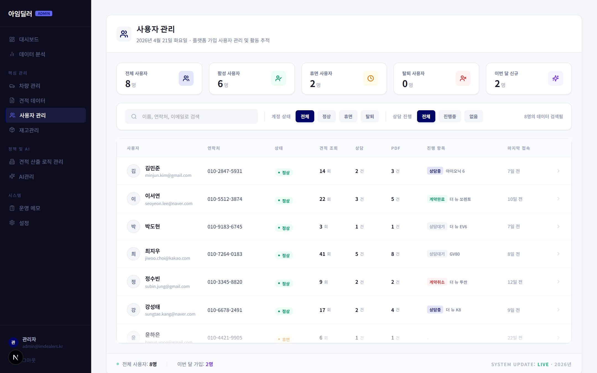

**경로**: `/admin/users`  
**목적**: 플랫폼 이용자 조회, 상태 관리, 활동 이력 확인

### 화면 구성 개요

```
┌──────────────────────────────────────────────────────────────┐
│ 사용자 관리                                                   │
├───────┬────────┬──────────┬───────────┬─────────────────────┤
│전체   │ 활성   │ 휴면     │ 탈퇴      │ 이번 달 신규        │
│사용자 │사용자  │ 사용자   │ 사용자    │                     │
├───────┴────────┴──────────┴───────────┴─────────────────────┤
│ [검색] [계정상태 필터: 전체/정상/휴면/탈퇴] [상담진행 필터]  │
├──────────────────────────────────────────────────────────────┤
│ 아바타+이름  │ 전화 │ 상태 │ 조회수 │ 상담 │ PDF │ 활성 │마지막│
│             │      │      │        │      │     │      │로그인│
└──────────────────────────────────────────────────────────────┘
                                  ┌───────────────────────────┐
                                  │ 사용자 상세 슬라이드 패널  │
                                  │ (우측에서 슬라이드 인)    │
                                  └───────────────────────────┘
```

### KPI 카드 (5개)

| 카드 | 설명 |
|------|------|
| 전체 사용자 | 전체 가입 사용자 수 |
| 활성 사용자 | 최근 30일 이내 로그인 사용자 |
| 휴면 사용자 | 90일 이상 미로그인 사용자 |
| 탈퇴 사용자 | 탈퇴 처리된 사용자 수 |
| 이번 달 신규 | 이번 달 신규 가입자 수 |

### 필터 및 검색

#### 검색창

- 이름, 전화번호, 이메일로 실시간 검색

#### 계정 상태 필터

| 탭 | 조건 |
|----|------|
| 전체 | 필터 없음 |
| 정상 | status = ACTIVE |
| 휴면 | status = DORMANT |
| 탈퇴 | status = WITHDRAWN |

#### 상담 진행 필터

| 탭 | 조건 |
|----|------|
| 전체 | 필터 없음 |
| 진행 중 | 활성 견적/상담 있는 사용자 |
| 없음 | 활성 견적/상담 없는 사용자 |

### 사용자 테이블

| 컬럼 | 설명 |
|------|------|
| 아바타 + 이름 + 이메일 | 사용자 식별 정보 |
| 전화 | 연락처 |
| 상태 | 상태 뱃지 |
| 견적 조회 수 | 해당 사용자의 견적 페이지 조회 횟수 |
| 상담 건수 | 생성한 견적(상담) 수 |
| PDF 다운로드 | PDF 다운로드 횟수 |
| 활성 항목 | 현재 진행 중인 견적/상담 수 |
| 마지막 로그인 | 마지막 접속 일시 |

#### 행 클릭 동작

```
사용자 행 클릭
→ 우측에 사용자 상세 슬라이드 패널 표시
```

### 사용자 상세 슬라이드 패널

| 영역 | 내용 |
|------|------|
| 헤더 | 아바타, 이름, 상태 뱃지 |
| 기본 정보 | 전화번호, 이메일, 가입일, 마지막 로그인 |
| 활동 통계 카드 | 견적 조회 수 / 상담 건수 / PDF 다운로드 수 |
| 활성 항목 목록 | 진행 중인 견적 목록 (클릭 시 견적 상세로 이동) |
| 관리자 메모 | 해당 사용자에 대한 내부 메모 (읽기 전용 표시) |
| [상담 이력 보기] | `/admin/quotations?search=고객명`으로 이동 |
| [활동 로그 보기] | 해당 사용자 활동 상세 로그 |

---

## 8. 재고 관리

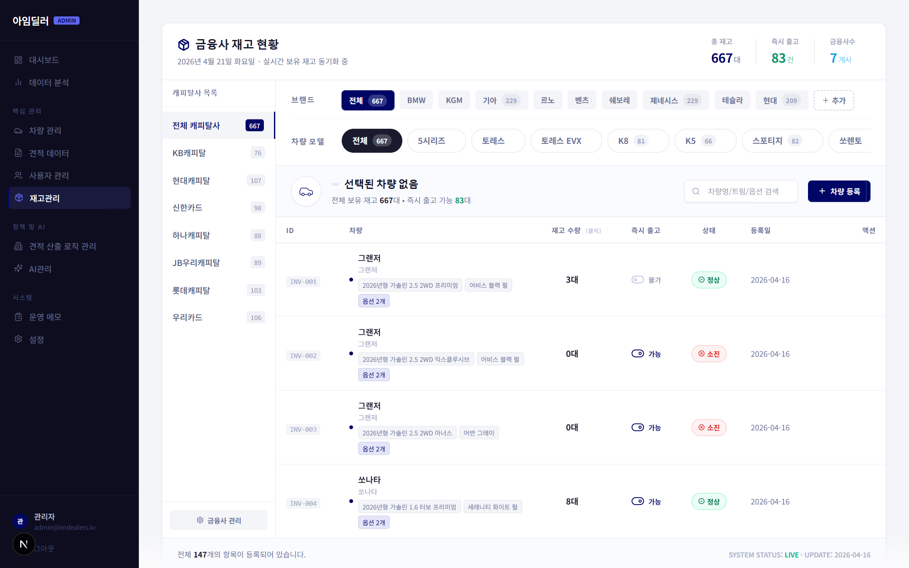

**경로**: `/admin/inventory`  
**목적**: 현재 노출 중인 차량의 트림 및 옵션 재고 현황 파악

### 화면 구성

- 노출 중인 차량 목록 표시
- 각 차량별:
  - 차량명, 브랜드, 이미지
  - 모든 트림 목록 (엔진 타입 포함)
  - 트림별 옵션 목록

### 주요 데이터

| 데이터 | 설명 |
|--------|------|
| 차량 메타 | id, slug, 차량명, 브랜드, 이미지 |
| 트림 | 트림명, 엔진 타입 |
| 옵션 | 옵션명, 가격 |

> **참고**: 재고 관리는 현재 조회 전용 기능입니다.  
> 차량/트림/옵션 데이터 수정은 **차량 관리** 페이지에서 진행하세요.

---

## 9. 견적 산출 로직 관리


**경로**: `/admin/finance`  
**목적**: 아임딜러의 핵심 금융 견적 엔진의 파라미터를 관리

### 화면 구성 — 3탭 구조

```
┌────────────────────────────────────────┐
│  [견적 시뮬레이터] [가산 정책] [회수율] │  ← 탭 네비게이션
├────────────────────────────────────────┤
│           탭별 콘텐츠 영역              │
└────────────────────────────────────────┘
```

---

### 탭 1: 견적 시뮬레이터 (QuoteLogicSimulator)

**목적**: 파라미터를 변경하기 전 실제 견적 결과를 시뮬레이션으로 미리 확인

#### 입력 파라미터

| 파라미터 | 유형 | 설명 |
|----------|------|------|
| 차량 가격 | 숫자 입력 | 시뮬레이션할 차량가 (원) |
| 계약 기간 | 드롭다운 | 24 / 36 / 48 / 60개월 |
| 약정 거리 | 드롭다운 | 1만 / 2만 / 3만 km |
| 보증금률 | 숫자 입력 | 0 ~ 30% (0이면 비활성) |
| 선납금률 | 숫자 입력 | 0 ~ 50% (보증금과 동시 입력 불가) |
| 순위 가산율 | 드롭다운 | 1순위(1%) / 2순위(1.5%) / 3순위(2%) / 4순위+(2.5%) |
| 차량 가산율 | 숫자 입력 | % 단위 직접 입력 |
| 금융사 가산율 | 숫자 입력 | % 단위 직접 입력 |

#### [시뮬레이션 실행] 버튼

```
[시뮬레이션 실행] 클릭
→ 클라이언트에서 quote-calculator.ts 로직 직접 실행
→ 단계별 계산 결과 표시:
  Step 1: 기준 월 납입금 (회수율 적용)
  Step 2: 보증금/선납금 적용
  Step 3: 순위 가산율 적용
  Step 4: 차량 가산율 적용
  Step 5: 금융사 가산율 적용
  → 최종 월 납입금 (Math.round 적용)
```

#### 결과 표시

| 항목 | 값 |
|------|-----|
| 조건 대여료 (monthlyBeforeSurcharge) | 가산 전 월 납입금 |
| 최종 월 납입금 | 최종 계산값 |
| 단계별 상세 분해표 | 각 단계 기여액 |

> **검증 케이스**: 아래 값으로 시뮬레이션하여 결과가 기준값과 ±1,000원 이내인지 확인하세요.  
> - 케이스 A: 43,840,000원 / 36개월 / 2만km / 보증금 10% → ~561,680원  
> - 케이스 B: 43,840,000원 / 36개월 / 1만km / 선납금 10% → ~421,750원

---

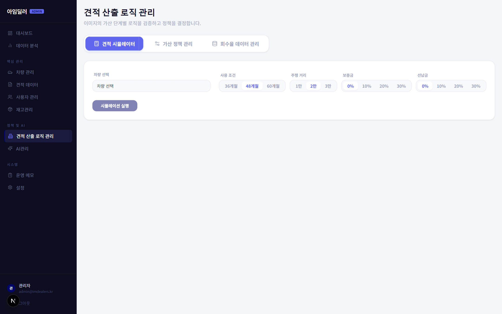

### 탭 2: 가산 정책 관리 (SurchargePolicy)

**목적**: 순위/차량/금융사별 가산율 정책 설정

#### 순위 가산율 설정

| 순위 | 기본값 | 설명 |
|------|-------|------|
| 1순위 | 1.0% | 검색 결과 1위 차량 |
| 2순위 | 1.5% | 검색 결과 2위 차량 |
| 3순위 | 2.0% | 검색 결과 3위 차량 |
| 4순위 이상 | 2.5% | 그 외 |

> **주의**: 순위 가산율 변경 시 모든 견적의 최종 금액에 즉시 영향을 미칩니다.  
> 반드시 견적 시뮬레이터로 검증 후 저장하세요.

#### 차량별 가산율

- 특정 차량에 개별 가산율 적용
- 인기 차종 수익 극대화 또는 판매 촉진 정책 반영

#### 금융사별 가산율

- 금융사마다 다른 가산율 설정
- 프로모션 또는 수수료 정책 반영

#### [저장] 버튼

```
[저장] 클릭
→ PATCH /api/admin/settings/policy
→ 성공 시: 성공 메시지 표시
→ 실패 시: 에러 메시지 표시
```

---

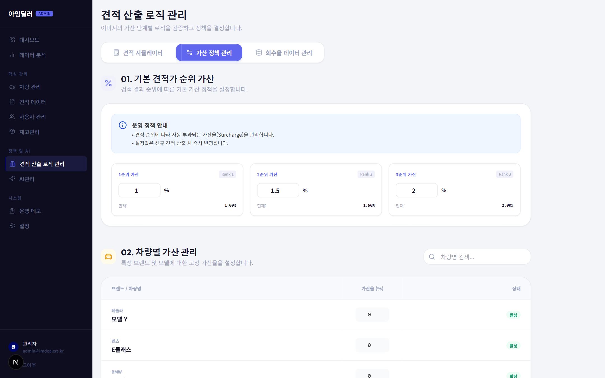

### 탭 3: 회수율 데이터 관리 (CapitalRateManager)

**목적**: 금융사 × 차량 조합별 회수율(월 납입금 비율) 설정

#### 화면 구조

- 금융사 선택 드롭다운
- 차량 선택 드롭다운
- 약정 기간별 회수율 입력 테이블:

| 약정 기간 | 1만km 회수율 | 2만km 회수율 | 3만km 회수율 |
|----------|------------|------------|------------|
| 24개월   | 입력란      | 입력란      | 입력란      |
| 36개월   | 입력란      | 입력란      | 입력란      |
| 48개월   | 입력란      | 입력란      | 입력란      |
| 60개월   | 입력란      | 입력란      | 입력란      |

#### 버튼

| 버튼 | 동작 |
|------|------|
| [저장] | `PATCH /api/admin/capital-rates/[id]` 또는 `POST /api/admin/capital-rates` |
| [이력 보기] | RateHistory 컴포넌트에서 변경 이력 표시 |

> **경고**: 회수율 변경은 즉시 실시간 견적에 반영됩니다.  
> ORIX × 쏘렌토 조합은 별도 하드코딩 값이 적용될 수 있습니다 (`prisma/seed.ts` 참조).

---

## 10. AI 관리

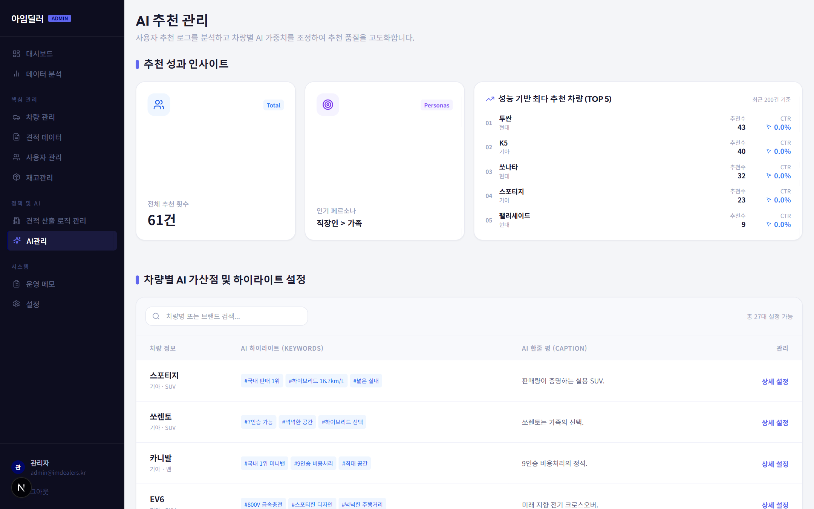

**경로**: `/admin/ai`  
**목적**: AI 차량 추천 시스템의 설정과 성과 지표 관리

### 화면 구성 — 2섹션

```
┌──────────────────────────────────────────────────┐
│  섹션 1: AI 인사이트 대시보드 (AiInsightDashboard)│
├──────────────────────────────────────────────────┤
│  섹션 2: 차량별 AI 설정 (VehicleAiSettings)      │
└──────────────────────────────────────────────────┘
```

---

### 섹션 1: AI 인사이트 대시보드

#### KPI 카드 (4개)

| 카드 | 설명 |
|------|------|
| 총 추천 건수 | AI 추천 요청 총 횟수 |
| 인기 페르소나 | 가장 많이 매칭된 사용자 유형 |
| 1위 추천 차량 | 가장 많이 추천된 차량 + CTR |
| 추천 클릭률 | 전체 추천 중 사용자 클릭 비율 |

#### 페르소나별 추천 현황

- 각 사용자 유형(가족, 비즈니스, 젊은 층 등)별 추천 건수 및 선택 비율

#### 차량별 CTR 순위

- 상위 추천 차량 목록 + 클릭률(CTR) + 전환율

---

### 섹션 2: 차량별 AI 설정 (VehicleAiSettings)

차량 목록이 표시되며, 각 차량별로 설정 가능:

| 설정 항목 | 설명 |
|----------|------|
| AI 부스트 포인트 | 추천 가중치 (높을수록 더 자주 추천됨) |
| AI 하이라이트 태그 | 차량 카드에 표시될 키워드 (예: #최강경제성, #패밀리카) |
| 추천 캡션 | AI가 이 차량을 추천할 때 표시할 설명 문구 |
| 추천 활성화 | 해당 차량의 AI 추천 포함 여부 |

#### 버튼

| 버튼 | 동작 |
|------|------|
| [저장] | `POST /api/admin/ai/config` → 설정 저장 |
| [초기화] | 해당 차량의 AI 설정을 기본값으로 복원 |

---

## 11. 운영 메모

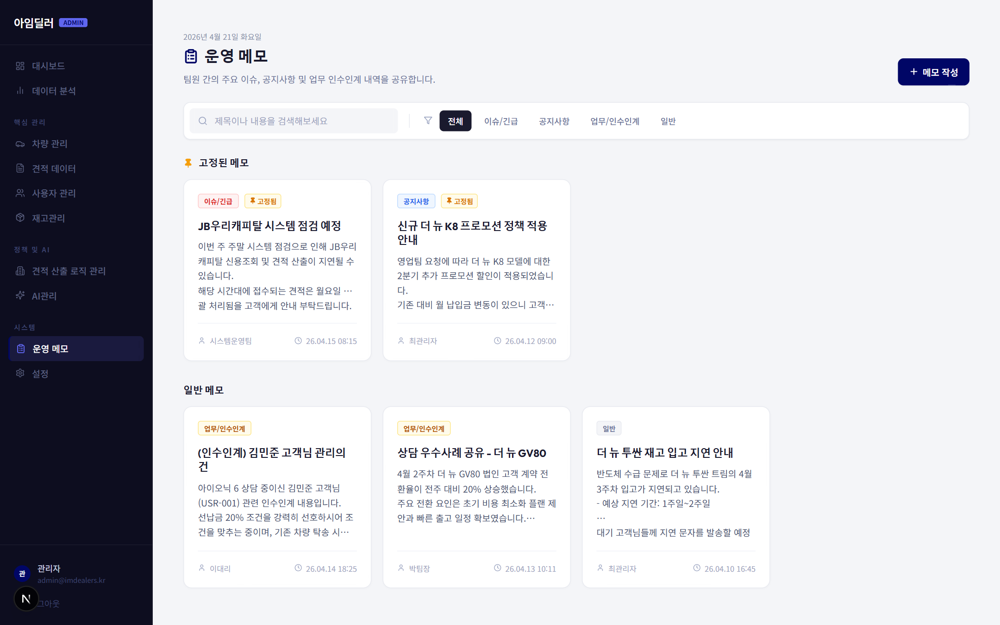

**경로**: `/admin/memo`  
**목적**: 팀 내 이슈, 공지, 업무 인수인계 메모 관리

### 화면 구성 개요

```
┌──────────────────────────────────────────────────────────────┐
│ 운영 메모           YYYY년 MM월 DD일    [+ 새 메모 작성]     │
├──────────────────────────────────────────────────────────────┤
│ [검색창]  [전체] [이슈/긴급] [공지사항] [업무/인수인계] [일반] │
├──────────────────────────────────────────────────────────────┤
│  📌 고정된 메모                                              │
│  ┌────────┐  ┌────────┐                                     │
│  │ 메모   │  │ 메모   │                                     │
│  │ 카드   │  │ 카드   │                                     │
│  └────────┘  └────────┘                                     │
│                                                              │
│  일반 메모                                                   │
│  ┌────────┐  ┌────────┐  ┌────────┐                        │
│  │ 메모   │  │ 메모   │  │ 메모   │                        │
│  └────────┘  └────────┘  └────────┘                        │
└──────────────────────────────────────────────────────────────┘
                                    ┌───────────────────────┐
                                    │ 메모 작성/편집 Drawer  │
                                    └───────────────────────┘
```

### 메모 작성 Drawer 미리보기

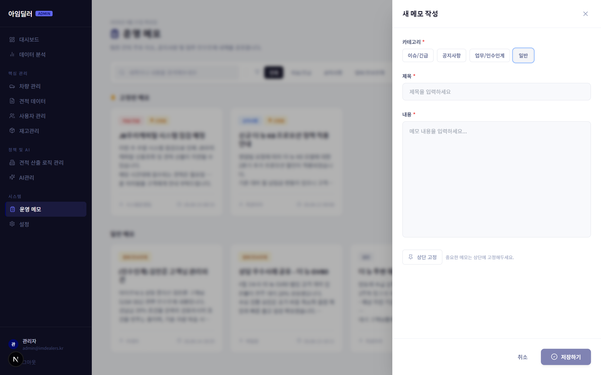

### 상단 버튼

#### [+ 새 메모 작성] 버튼

```
클릭 시
→ 우측에서 메모 작성 Drawer 슬라이드 인
→ 빈 폼 표시 (신규 작성 모드)
```

### 검색 및 필터

#### 검색창

- 메모 제목 및 내용에서 검색
- 입력 시 실시간 필터링

#### 카테고리 필터 탭

| 탭 | 필터 조건 |
|----|---------|
| 전체 | 모든 메모 |
| 이슈/긴급 | category = ISSUE |
| 공지사항 | category = NOTICE |
| 업무/인수인계 | category = HANDOVER |
| 일반 | category = GENERAL |

### 메모 카드

각 카드 구성:

| 요소 | 설명 |
|------|------|
| 카테고리 뱃지 | 색상 코딩된 카테고리 표시 |
| 📌 아이콘 | 고정된 메모 표시 |
| 제목 | 메모 제목 |
| 내용 미리보기 | 최대 3줄 (line-clamp) |
| 작성자 + 날짜 | 하단 메타 정보 |

#### 카드 호버 시 나타나는 액션 버튼

| 버튼 | 동작 |
|------|------|
| 📌 핀 토글 | 고정/해제 전환 → DB 업데이트 |
| ✏️ 편집 | 해당 메모 내용으로 편집 Drawer 열기 |
| 🗑️ 삭제 | 확인 다이얼로그 → 삭제 실행 → 목록에서 제거 |

#### 고정 메모 섹션

- 핀 설정된 메모는 "📌 고정된 메모" 섹션 상단에 별도 표시
- 일반 메모보다 항상 위에 위치

### 메모 작성/편집 Drawer

| 요소 | 동작 |
|------|------|
| 카테고리 선택 버튼들 | 이슈/긴급 / 공지사항 / 업무·인수인계 / 일반 선택 |
| 제목 입력란 | 메모 제목 작성 |
| 내용 텍스트에어리어 | 메모 본문 작성 |
| 📌 고정 버튼 | 고정 여부 토글 (ON/OFF 상태 표시) |
| [취소] | Drawer 닫기 (작성 내용 삭제) |
| [저장] | 신규: `POST /api/admin/memos` / 수정: `PATCH /api/admin/memos/[id]` |

---

## 12. 설정

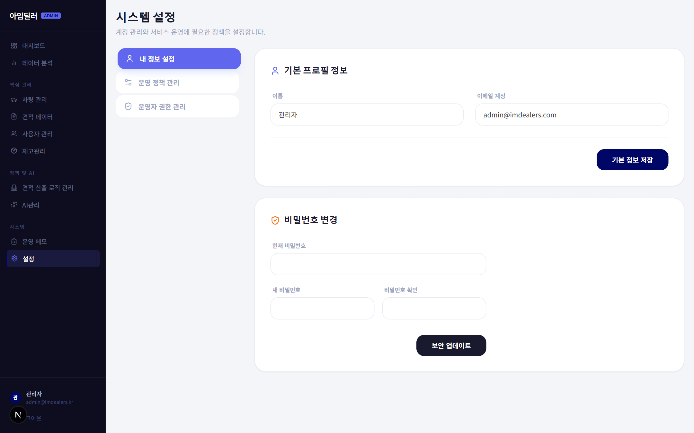

**경로**: `/admin/settings`  
**목적**: 관리자 개인 정보 및 시스템 전체 설정 관리

### 화면 구성 — 좌측 탭 네비게이션

```
┌───────────────────┬───────────────────────────────────────┐
│  내 정보 설정     │          선택한 탭의 콘텐츠            │
│  운영 정책 관리*  │                                       │
│  운영자 권한 관리*│                                       │
│                   │  (* 슈퍼 관리자(admin)만 표시)        │
└───────────────────┴───────────────────────────────────────┘
```

---

### 탭 1: 내 정보 설정 (모든 관리자 접근 가능)

#### 프로필 정보 수정

| 필드 | 설명 |
|------|------|
| 이름 | 관리자 표시 이름 |
| 이메일 | 로그인 이메일 (변경 시 재로그인 필요할 수 있음) |

#### [프로필 저장] 버튼

```
[저장] 클릭
→ PATCH /api/admin/auth/me (name, email)
→ 성공 시: "저장되었습니다" 메시지 표시 (3초 후 사라짐)
→ 실패 시: 에러 메시지 표시
```

#### 비밀번호 변경

| 필드 | 설명 |
|------|------|
| 현재 비밀번호 | 기존 비밀번호 확인용 |
| 새 비밀번호 | 변경할 비밀번호 |
| 새 비밀번호 확인 | 동일 여부 검증 |

#### [비밀번호 변경] 버튼

```
[변경] 클릭
→ 유효성 검사:
  - 새 비밀번호 = 확인 비밀번호 불일치 시 에러
  - 현재 비밀번호 오류 시 에러
→ PATCH /api/admin/auth/me (currentPassword, newPassword)
→ 성공 시: "비밀번호가 변경되었습니다" 메시지
```

---

### 탭 2: 운영 정책 관리 (슈퍼 관리자 전용)

**컴포넌트**: `PolicyManager`

#### 글로벌 파라미터 설정

| 파라미터 | 설명 |
|----------|------|
| 보증금 할인율 (depositDiscountRate) | 보증금 적용 시 대여료 할인율 (기본: -0.000523, 음수) |
| 선납금 조정율 (prepayAdjustRate) | 선납금 적용 시 대여료 조정율 (기본: +0.000073, 양수) |
| 기본 약정 거리 | 기본 선택될 약정 거리 |
| 기본 계약 기간 | 기본 선택될 계약 기간 |

> **경고**: 이 값들은 모든 차량의 견적에 전역 적용됩니다.  
> 변경 전 반드시 견적 시뮬레이터에서 검증하세요.

#### [저장] 버튼

```
→ POST /api/admin/settings/policy
→ 성공 시: 정책 즉시 적용
```

---

### 탭 3: 운영자 권한 관리 (슈퍼 관리자 전용)

**컴포넌트**: `AdminManager`

#### 관리자 목록

| 컬럼 | 설명 |
|------|------|
| 이름 | 관리자 이름 |
| 이메일 | 로그인 이메일 |
| 역할 | admin (슈퍼) / operator (일반) |
| 등록일 | 계정 생성일 |
| 상태 | 활성 / 비활성 |

#### [+ 관리자 추가] 버튼

```
→ 추가 폼 표시 (이름, 이메일, 비밀번호, 역할 선택)
→ [저장]: POST /api/admin/settings/admins
```

#### 관리자 행의 [편집] / [삭제] 버튼

| 버튼 | 동작 |
|------|------|
| [편집] | 해당 관리자 정보 수정 폼 표시 → `PATCH /api/admin/settings/admins/[id]` |
| [삭제] | 확인 다이얼로그 → `DELETE /api/admin/settings/admins/[id]` |

> **주의**: 자기 자신의 계정은 삭제할 수 없습니다.

---

## 13. 서류 확인 (Verifications)

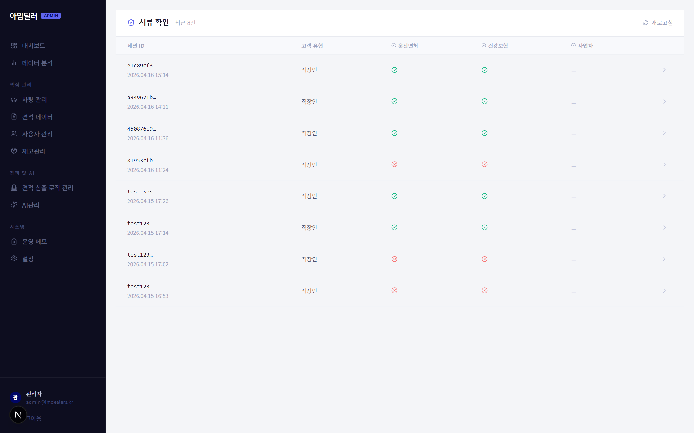

**경로**: `/admin/verifications`  
**목적**: 고객이 제출한 서류(운전면허/보험/사업자등록증)의 본인인증 결과 조회

### 화면 구성

```
┌────────────────────────────┬───────────────────────────────┐
│     세션 목록 (좌측)        │     상세 결과 (우측)           │
│                            │                               │
│  [새로고침]                │  VerificationResult 컴포넌트  │
│  ┌──────────────────────┐  │                               │
│  │ 세션 ID │ 운면 │보험  │  │  - 운전면허 확인 결과         │
│  │ 세션 ID │ ✓   │ ✗   │  │  - 보험 확인 결과             │
│  └──────────────────────┘  │  - 사업자등록 확인 결과        │
└────────────────────────────┴───────────────────────────────┘
```

### 세션 목록

| 컬럼 | 설명 |
|------|------|
| 세션 ID | 단축 표시 (앞 8자리) |
| 고객 유형 | 개인 / 법인 |
| 운전면허 | ● 초록 (확인됨) / ● 빨강 (미확인) |
| 보험 | ● 초록 / ● 빨강 |
| 사업자등록 | ● 초록 / ● 빨강 / - (해당 없음) |

#### [새로고침] 버튼

```
→ GET /api/admin/verifications 재호출
→ 목록 업데이트
```

#### 세션 행 클릭

```
→ 우측 패널에 해당 세션의 VerificationResult 표시
→ GET /api/verification/session/[sessionId] 호출
→ 상세 결과 렌더링
```

### VerificationResult 컴포넌트

각 서류 유형별 결과 표시:

| 서류 | 확인 항목 |
|------|---------|
| 운전면허 | 면허 번호, 발급일, 적격 여부 |
| 자동차보험 | 보험 유형, 만기일, 적격 여부 |
| 사업자등록 | 사업자 번호, 대표자명, 적격 여부 |

---

## 14. 회수율 설정 (Recovery Rates)

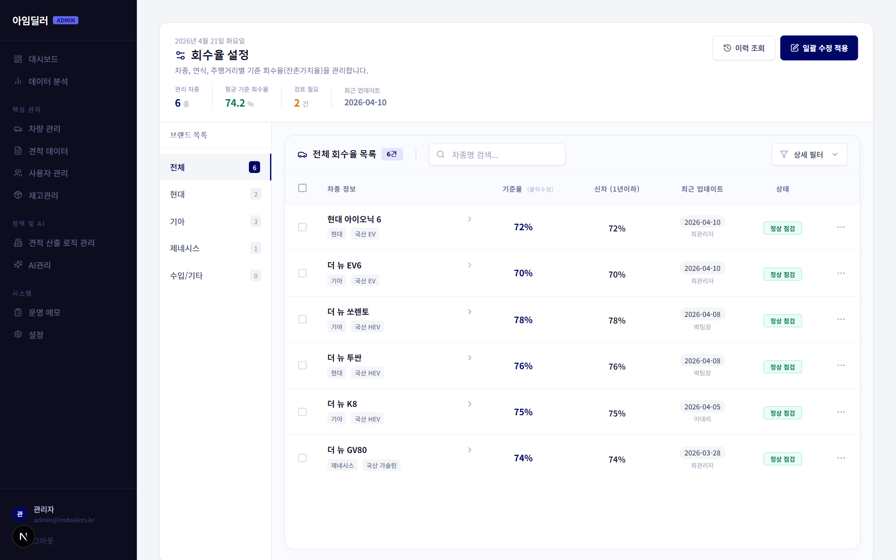

**경로**: `/admin/recovery-rates`  
**목적**: 브랜드/모델별 차량 회수율(잔존 가치 비율) 설정

### 화면 구성

```
┌────────────────────────────────────────────────────────────┐
│ 회수율 설정     [총 N개] [평균 X%] [검토 대기 N] [최종 수정]│
│                          [이력 보기]  [일괄 업데이트]       │
├──────────────┬─────────────────────────────────────────────┤
│ 브랜드 목록  │           회수율 테이블                     │
│ (좌측 사이드)│  (RecoveryRateTable)                        │
│              │                                             │
│ 현대 (N)    │   인라인 편집 가능                           │
│ 기아 (N)    │                                             │
│ 벤츠 (N)   │                                             │
└──────────────┴─────────────────────────────────────────────┘
```

### 상단 KPI 칩

| 칩 | 설명 |
|----|------|
| 총 N개 모델 | 등록된 전체 모델 수 |
| 평균 X% | 전체 회수율 평균 |
| 검토 대기 N건 | 수정 후 미저장 항목 수 |
| 최종 수정 | 마지막 수정 일시 |

### 브랜드 선택 사이드바

- 브랜드명 + 모델 수 배지
- 클릭 시 우측 테이블에 해당 브랜드 모델만 표시

### 회수율 테이블 (RecoveryRateTable)

| 컬럼 | 설명 |
|------|------|
| 모델명 | 차량 모델 |
| 카테고리 | 세단 / SUV / 해치백 등 |
| 기간별 회수율 | 24/36/48/60개월별 인라인 편집 |
| 마지막 수정일 | 해당 모델 회수율 최종 수정 일시 |

#### 인라인 편집

```
테이블 셀 클릭
→ 입력란으로 전환
→ 값 수정 후 Enter 또는 blur
→ 변경 사항 임시 저장 (빨간 점 표시)
→ [저장] 버튼 클릭 시 PATCH /api/admin/capital-rates/[id] 호출
```

### [이력 보기] 버튼

```
→ RateHistoryTimeline 모달 열기
→ 변경 이력 목록 표시:
   - 변경 일시
   - 변경자
   - 변경 전/후 값
   - 변경 사유
```

### [일괄 업데이트] 버튼

```
→ BatchUpdateModal 열기
```

#### BatchUpdateModal 구성

| 필드 | 설명 |
|------|------|
| 대상 브랜드 | 드롭다운 (특정 브랜드 또는 전체) |
| 대상 카테고리 | 드롭다운 (특정 카테고리 또는 전체) |
| 조정 값 | 숫자 입력 (예: 0.5%) |
| 조정 방향 | [인상] / [인하] 토글 |
| 변경 사유 | 텍스트 입력 (이력 기록용) |

```
[일괄 적용] 클릭
→ 조건에 맞는 모든 회수율에 조정값 적용
→ 이력 자동 기록
→ 성공 시: 모달 닫힘 + 테이블 갱신
```

---

## 15. PDF 내보내기 가이드

### 방법 1: 브라우저 인쇄 (권장)

1. 내보낼 페이지로 이동
2. 브라우저 메뉴 → **인쇄** (또는 `Ctrl+P` / `Cmd+P`)
3. 대상: **PDF로 저장** 선택
4. 설정:
   - 용지: A4
   - 여백: 최소
   - **배경 그래픽 포함** 체크 (차트가 흰색으로 나오지 않도록)
5. [저장] 클릭

### 방법 2: 데이터 분석 페이지 내 PDF 내보내기

1. `/admin/analytics` 이동
2. 우상단 **[PDF 내보내기]** 버튼 클릭
3. 브라우저 인쇄 다이얼로그에서 PDF로 저장

### 방법 3: 매뉴얼 PDF 변환

이 `ADMIN_MANUAL.md` 파일을 PDF로 변환하려면:

```bash
# 방법 A: Pandoc 사용 (설치 필요)
pandoc ADMIN_MANUAL.md -o ADMIN_MANUAL.pdf --pdf-engine=wkhtmltopdf

# 방법 B: VS Code 확장 사용
# "Markdown PDF" 확장 설치 후
# Ctrl+Shift+P → "Markdown PDF: Export (pdf)"
```

---

## 부록: 주요 API 엔드포인트 요약

| 엔드포인트 | 메서드 | 설명 |
|------------|--------|------|
| `/api/admin/auth/login` | POST | 로그인 |
| `/api/admin/auth/logout` | POST | 로그아웃 |
| `/api/admin/auth/me` | GET/PATCH | 내 정보 조회/수정 |
| `/api/admin/dashboard/stats` | GET | 대시보드 KPI 통계 |
| `/api/admin/analytics` | GET | 분석 데이터 |
| `/api/admin/vehicles` | GET/POST | 차량 목록 조회/추가 |
| `/api/admin/vehicles/[id]` | GET/PATCH/DELETE | 차량 상세 조회/수정/삭제 |
| `/api/admin/vehicles/[id]/trims` | GET/POST | 트림 조회/추가 |
| `/api/admin/vehicles/[id]/trims/[trimId]` | PATCH/DELETE | 트림 수정/삭제 |
| `/api/admin/trims/[trimId]/options` | GET/POST | 옵션 조회/추가 |
| `/api/admin/trims/[trimId]/options/[optId]` | PATCH/DELETE | 옵션 수정/삭제 |
| `/api/admin/brands` | GET/POST | 브랜드 조회/추가 |
| `/api/admin/quotes` | GET | 견적 목록 조회 |
| `/api/admin/capital-rates` | GET/POST | 회수율 조회/추가 |
| `/api/admin/capital-rates/[id]` | PATCH/DELETE | 회수율 수정/삭제 |
| `/api/admin/finance-companies` | GET/POST | 금융사 조회/추가 |
| `/api/admin/ai/config` | GET/POST | AI 설정 조회/저장 |
| `/api/admin/settings/policy` | GET/POST | 운영 정책 조회/저장 |
| `/api/admin/settings/admins` | GET/POST | 관리자 목록/추가 |
| `/api/admin/settings/admins/[id]` | PATCH/DELETE | 관리자 수정/삭제 |
| `/api/admin/verifications` | GET | 서류 확인 목록 조회 |
| `/api/admin/upload` | POST | 이미지 파일 업로드 |
| `/api/verification/session/[sessionId]` | GET | 특정 서류 확인 결과 조회 |

---

## 부록: 색상 체계 참고

| 용도 | 색상 코드 |
|------|----------|
| 주요 색상 (Primary) | `#000666` |
| 강조 색상 (Accent) | `#6066EE` |
| 배경 | `#F8F9FC` |
| 진한 텍스트 | `#1A1A2E` |
| 흐린 텍스트 (Muted) | `#9BA4C0` |
| 사이드바 배경 | `#0D0D1F` |
| 보더 | `#E8EAF0` |
| 성공 | `#10B981` |
| 경고 | `#F59E0B` |
| 오류 | `#EF4444` |

---

> **문의**: 매뉴얼 내용에 오류가 있거나 업데이트가 필요한 경우  
> 운영 메모 페이지(`/admin/memo`)에 [공지사항] 또는 [이슈/긴급] 카테고리로 등록해주세요.

*아임딜러 어드민 운영 매뉴얼 v2.0 — 2026-04-21*
